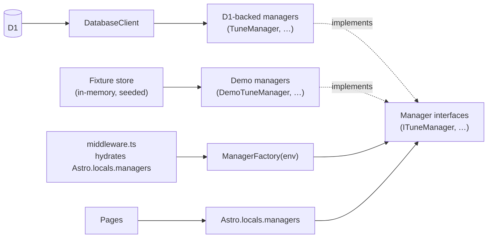

# ForzaTunes — Architecture

## 1. Overview

ForzaTunes is an open-source community site for discovering, sharing, and starring player-created tunes for Forza titles (starting with **Forza Horizon 5** and **Forza Motorsport**; additional games are configured in data, not hard-coded). The app is built with **Astro 6** in **server** output mode, deployed to **Cloudflare Pages** so each request runs on the **Workers** runtime at the edge. **Cloudflare D1** (SQLite) stores tunes, users, and stars. **React** is used only in **islands** for search, filters, forms, and the star control; everything else is Astro + **Tailwind CSS 4**. **TypeScript** is **strict**. **Discord OAuth** is the first-party auth provider, behind a small provider abstraction.

---

## 2. Rendering Strategy

Astro `output: "server"` is the default: pages hit the Worker unless they opt into static HTML.

| Route / area | Mode | Rationale |
|--------------|------|-----------|
| `/` (`index.astro`) | **Static** (`prerender = true`) | Marketing / landing; no per-user DB read; **zero Worker invocation** on each visit once deployed. |
| `/404` (`404.astro`) | **Static** (`prerender = true`) | Custom not-found page; same cost profile as landing. |
| `/[game]` (game home) | **SSR** (cache-friendly) | Read-heavy: recent tunes + counts; responses are good **CDN cache** candidates (short TTL, vary by URL) because content changes slowly. |
| `/[game]/tunes` (browse) | **SSR** (cache-friendly) | Read-heavy listing with query params for search/sort/filter; cache keys naturally follow the URL. |
| `/[game]/tunes/[id]` (detail) | **SSR** (cache-friendly) | Read-heavy detail view; same caching story as browse. |
| `/auth/*` (login, callback, logout) | **SSR** (dynamic) | OAuth state, redirects, and token exchange must be **fresh** and **not** publicly cached. |
| `/[game]/submit` | **SSR** (dynamic) | Authenticated flow + writes + rate limiting; must not be stale. |
| `/api/stars` | **SSR** / API (dynamic) | Mutating **POST**; no CDN cache; needs current session. |
| `/profile` | **SSR** (dynamic) | Per-user data and tabs; depends on **session** in `Astro.locals`. |

**Note:** “SSR (cached)” here means *architecturally appropriate for edge HTTP caching* (public, read-mostly GETs). Configure `Cache-Control` / Cloudflare rules as needed; prerender remains only for explicitly static routes.

---

## 3. Data Flow

**High-level path:**

1. **D1** holds relational data (games, cars, users, tunes, stars).
2. **`DatabaseClient`** wraps `D1Database` with `query`, `queryOne`, `execute`, and `batch` for typed access.
3. **Manager interfaces** (`ITuneManager`, `IGameManager`, `ICarManager`, `IStarManager`, `IUserManager`, `IReportManager` in `src/lib/managers/interfaces/`) define the contract every manager must satisfy.
4. **D1-backed managers** (`TuneManager`, `GameManager`, …) `implements` those interfaces and encapsulate SQL/business rules; they take `DatabaseClient` via **constructor injection**.
5. **`ManagerFactory.createManagers(env)`** branches on `env.DEMO_MODE`: returns the D1-backed managers (default) or **demo managers** (in-memory fixture-backed) when `DEMO_MODE=true`.
6. **Middleware** calls `createManagers(env)` once per request and stores the bag on **`Astro.locals.managers`**, alongside `Astro.locals.user` from the session.
7. **Astro pages** read managers from `Astro.locals.managers` and pass props into **Astro components**.
8. **React islands** hydrate only where needed: they drive UI state (filters, sort, search) and **either** sync via **URL search params** (shareable browse state) **or** call **`fetch`** (e.g. star toggle → `/api/stars`).



**Middleware** runs before pages: it builds the manager bag, validates the session cookie, and sets **`Astro.locals.user`** when valid (see Auth).

### Demo mode

Set **`DEMO_MODE=true`** to swap the factory's outputs for in-memory managers seeded with deterministic fixtures (~500 tunes across all games, 15 fabricated creators, weighted star distribution). Useful for previewing the UI without a populated D1 database, taking screenshots, or doing UI work on flights.

- **Read paths** return fixture data identical across reloads (seeded PRNG).
- **Write paths** (submit, edit, delete, star, report) succeed and are reflected in the same Worker isolate, but are **ephemeral** — they reset when the isolate restarts. There is no persistence layer in demo mode.
- **No cross-isolate state**: in Cloudflare preview/production, separate isolates each have their own `DemoStore`. Demo mode is intended for dev / preview / screenshots, not production.
- **Env / D1 bypass**: `DEMO_MODE=true` short-circuits the factory before any `DatabaseClient` is constructed, so the path works without a configured `DB` binding.

---

## 4. Multi-Game Architecture

### Source of truth in the repo: `src/data/games.json`

Each entry describes one supported title:

- **`slug`** — URL segment (e.g. `fh5`, `fm`).
- **`name`** — Display name.
- **`shareCodeLength`** — Expected share code length for that title.
- **`tuneTypes`** — Allowed tune categories (`value` + `label`).
- **`carClasses`** — Allowed class letters/strings.
- **`piRange`** — Min/max PI for validation and UI.

### Dynamic `[game]` routes

- **`Astro.params.game`** is validated against known slugs (via **`GameManager`** / config loaded from **`games.json`**).
- Unknown slug → redirect to **`/404`** (or site 404 behavior).

### Cars

- Per-game car lists live under **`src/data/cars/`** (e.g. `fh5.json`, `fm.json`, plus additional files as games are added). These files are **community-editable** catalog data, not authoritative for every in-game vehicle variant.

### Database scoping

- Rows in **`tunes`** and **`cars`** include **`game_id`** (FK to **`games`**). **All tune queries are scoped by `game_id`** so listings and detail views cannot leak across titles.

### Adding a new game

1. Add a **`games.json`** entry (slug, labels, tune types, classes, PI range, share code rules).
2. Add **`src/data/cars/<slug>.json`** (or the project’s chosen naming convention for that game).
3. Ensure the **`games`** table has a matching row (typically via **seed** / migration data) so D1 **`game_id`** aligns with the slug used in URLs.
4. Run **migrations** (if schema changes) and **re-seed** local/remote D1 as documented in `package.json` scripts.

---

## 5. Database

**Engine:** Cloudflare **D1** (SQLite at the edge).

### Tables (6)

| Table | Purpose |
|-------|---------|
| **`games`** | Canonical game row: `slug`, `name`, `share_code_length`, timestamps. |
| **`cars`** | Vehicles for a game: `game_id`, make/model/year/category; indexed by `game_id`. |
| **`users`** | Local user profile: `username`, `avatar_url`. |
| **`auth_accounts`** | Linked OAuth accounts: `provider`, `provider_id`, `user_id`; **unique** `(provider, provider_id)`. |
| **`tunes`** | Submissions: `game_id`, `share_code`, `car_id`, metadata, `user_id`; **unique** `(game_id, share_code)`. |
| **`stars`** | Favorites: `user_id`, `tune_id`; **unique** `(user_id, tune_id)`. |

### Relationships (summary)

- **`games`** 1─* **`cars`**, **`tunes`**
- **`users`** 1─* **`auth_accounts`**, **`tunes`**, **`stars`**
- **`tunes`** *─* **`stars`** (via `tune_id`)

### D1 / SQLite notes

- Foreign keys are declared with **`ON DELETE CASCADE`** (or **`RESTRICT`** on `tunes.car_id` to protect car references).
- Use **indexes** on `game_id`, browse columns, and star lookups (see migrations).
- Prefer **`DatabaseClient.batch`** for multi-statement writes where appropriate.

---

## 6. Auth Architecture

### `AuthProvider` (`src/lib/auth/AuthProvider.ts`)

Small interface for **multi-provider** readiness:

- `getAuthUrl(state)` — redirect to provider.
- `exchangeCode(code)` — trade auth code for tokens.
- `getUserProfile(accessToken)` — normalize `providerId`, `username`, `avatarUrl`.

### `DiscordAuthProvider`

Concrete implementation for Discord’s OAuth2 endpoints and profile shape.

### `AuthCoordinator`

Orchestrates post-callback flow: uses provider profile to **find or create** **`users`** / **`auth_accounts`** rows (no raw provider IDs exposed to the UI layer).

### `SessionManager`

- Issues an **httpOnly**, **Secure**, **SameSite=Lax** cookie (`ft_session`).
- Payload is protected with **AES-GCM** using the **Web Crypto API** (`crypto.subtle`), keyed from **`SESSION_SECRET`**.
- **Validate** on each request: decrypt, check expiry, load stable **`userId`** + display fields.

### Middleware (`src/middleware.ts`)

- Reads the session cookie.
- On success, sets **`Astro.locals.user`** (`id`, `username`, `avatarUrl`) for pages and API routes.
- Pages check **`Astro.locals.user`** for gated actions (submit, profile, stars).

---

## 7. Key Patterns

### Managers (domain layer)

- One primary manager per concern: **`TuneManager`**, **`CarManager`**, **`GameManager`**, **`StarManager`**, **`UserManager`**, **`ReportManager`**.
- Each one **implements** an interface from `src/lib/managers/interfaces/` so callers depend on the contract, not the concrete class.
- **Constructor-injected** `DatabaseClient` — no global D1 access inside managers.
- Pages and API routes consume managers via **`Astro.locals.managers`**, populated by middleware from **`ManagerFactory.createManagers(env)`**.

### Mappers (`tuneMappers.ts` and similar)

- Translate **snake_case** D1 result rows to **camelCase** **domain models** (`src/lib/models/`) consumed by Astro and React.

### Validators

- **`ShareCodeValidator`** — length/alphabet per **`shareCodeLength`** from game config.
- **`TuneValidator`** — tune type, class, PI range, and other rules **per game** using **`games.json`** metadata.

### React islands

- **Default:** Astro components for layout and content (fast, minimal JS).
- **Islands:** React for **SearchBar**, **FilterPanel**, **SortControls**, **TuneForm**, **StarButton** — only where **client-side** behavior is required.

### Rate limiting

- **`RateLimiter`** / configured limiters (e.g. submit) protect hot paths from abuse without pushing logic into UI.

---

## 8. Environment & Runtime

- **Runtime:** Cloudflare **Workers** (Pages Functions) — not Node.js.
- **Bindings / env:** import **`env`** from **`"cloudflare:workers"`** in server code (pages, endpoints, middleware) per `@astrojs/cloudflare` conventions.
- **D1:** exposed as **`env.DB`** (typed as `D1Database`); pass into **`new DatabaseClient(env.DB)`**.
- **Secrets:** Discord client secret, **`SESSION_SECRET`**, and similar values live as **environment variables / secrets** in Wrangler / Pages dashboard — never committed.

---

## 9. Directory layout (reference)

```text
src/
├── components/
│   ├── layout/          # PageShell, Header, Footer, GameNav
│   ├── islands/         # SearchBar, FilterPanel, SortControls (React)
│   ├── submit/          # TuneForm (React)
│   └── tune/            # StarButton (React)
│   # Root: TuneCard, TuneGrid, TuneDetail, Badge, GameBadge, ShareCodeDisplay,
│   #       GameCard, Pagination, … (Astro)
├── data/
│   ├── games.json
│   └── cars/            # Per-game lists (e.g. fh5.json, fm.json, …)
├── lib/
│   ├── auth/
│   ├── db/              # DatabaseClient, migrations, seed
│   ├── fixtures/        # Deterministic seed data for DEMO_MODE
│   ├── managers/
│   │   ├── interfaces/  # ITuneManager, IGameManager, ... (contracts)
│   │   └── demo/        # In-memory managers + DemoStore
│   ├── middleware/
│   ├── models/
│   ├── validators/
│   └── ManagerFactory.ts # createManagers(env): D1 vs demo
├── pages/
│   ├── index.astro
│   ├── 404.astro
│   ├── api/stars.ts
│   ├── auth/
│   ├── profile/
│   └── [game]/          # game home, tunes, detail, submit
├── styles/global.css
└── middleware.ts
```

This document describes **ForzaTunes** only and should be updated when routes, caching, or schema evolve.
